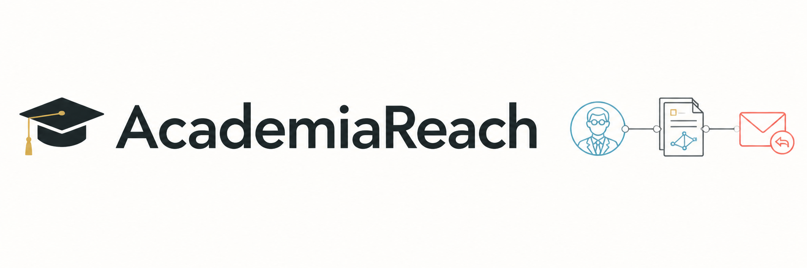
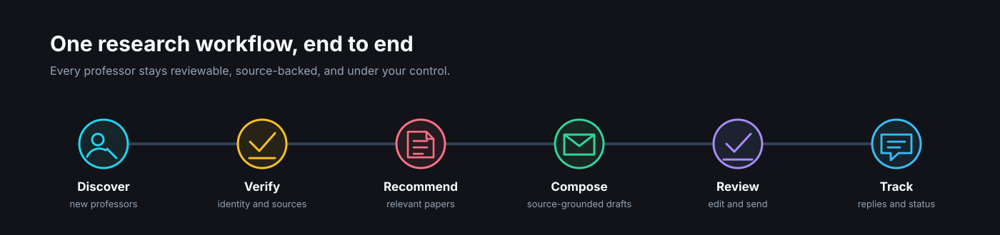
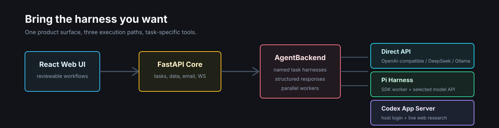

<p align="center">
  
</p>

<h1 align="center">AcademiaReach</h1>

<p align="center">
  从导师发现、代表作研究、邮件撰写到回复跟踪，一套强调证据、人工审核与隐私边界的博士套磁工作台。
</p>

<p align="center">
  <a href="README.md">English</a> ·
  <a href="#快速开始">快速开始</a> ·
  <a href="#agent-后端">Agent 后端</a> ·
  <a href="docs/cloudflare-tunnel.zh-CN.md">私有部署</a>
</p>

<p align="center">
  
  
  
  
  
  
  
</p>

## 这是什么

AcademiaReach 把博士套磁中分散的工作整理成一个可追踪流程：从公开来源发现新导师，核验姓名与联系方式，结合申请者 Profile 推荐代表作，生成有证据支撑的草稿，并在人工确认后发送和跟踪回复。

它定位为个人研究工作台，而不是无人监管的群发工具。导师来源、推荐论文和邮件内容都可以检查；草稿可以编辑；发送必须显式确认；真实 Profile、凭据与附件不会进入 Git。

| 能力 | 当前实现 |
|---|---|
| 导师发现 | Agent 分批并发搜索、CSRankings 候选、地区与方向筛选、持久化“新”标签 |
| 数据质量 | 核验主页、邮箱与 Google Scholar；还原反爬邮箱；仅中国大陆导师使用准确中文名；自动合并重复记录 |
| 研究辅助 | 导师研究摘要、代表作、按相关性与被引证据推荐论文、结合申请背景生成阅读理由 |
| 邮件工作流 | 中英文模板、围绕代表作的克制讨论、可编辑草稿、按语言命名附件、SMTP 发送 |
| 回复管理 | IMAP 轮询、邮件对话、草稿和已发送视图、导师级任务状态、WebSocket 实时进度 |
| 部署运行 | Direct、Pi、Codex 三种执行路径，并发 Worker、Docker、可选 Cloudflare Access 保护 |

## 工作流

<p align="center">
  
</p>

1. **发现**：按研究方向和地区拆分任务，优先寻找数据库外的新导师。
2. **核验**：保存前确认姓名、学校主页、邮箱和 Scholar 信息。
3. **补全**：生成研究摘要，并结合申请者 Profile 推荐值得阅读的代表作。
4. **写信**：中文遵循明确 Prompt 约束，英文使用固定私有模板，并复用已核验信息。
5. **审核**：发送前检查主题、正文和附件，随时修改或删除草稿。
6. **跟踪**：统一查看发送状态、回复和导师维度的邮件对话。

## Agent 后端

<p align="center">
  
</p>

设置页将“任务 Harness”和“底层模型 API”分开选择。

| 后端 | 凭据 | 网页研究 | 适合场景 |
|---|---|---|---|
| `direct` | OpenAI 兼容或 DeepSeek Key，也可以使用本地 Ollama | 不提供 Agent 网页工具 | Profile 生成和普通模型调用 |
| `pi` | 复用所选 OpenAI 兼容、DeepSeek 或 Ollama 配置 | 在任务 Harness 内使用只读搜索工具 | 基于 API 的搜索、补全、论文推荐与写信 |
| `codex` | 复用宿主机 `codex login` 会话 | 使用 Codex 实时网页研究 | 不在应用内填写模型 API Key 的完整 Agent 工作流 |

导师搜索、自动补全和论文推荐需要选择 `pi` 或 `codex`。Worker 会为搜索、研究、写信与 Profile 生成加载不同 Harness，使用结构化输出，并在隔离的临时工作目录中运行。

## 快速开始

### 环境要求

- Python 3.11
- Node.js 18 或更高版本
- `npm`；Pi 安装脚本会在需要时准备固定版本的 Bun 运行时
- 仅使用 `codex` 后端时需要 Codex CLI

### 1. 安装

```bash
git clone https://github.com/Joky02/AcademiaReach.git
cd AcademiaReach

conda create -n academia python=3.11 -y
conda activate academia
pip install -r backend/requirements.txt

cd frontend
npm install
cd ..
```

### 2. 创建私有配置

```bash
cp backend/config/config.yaml.example backend/config/config.yaml
cp backend/config/my_profile.example.md backend/config/my_profile.md

mkdir -p backend/config/email_templates
cp backend/templates/compose_en.example.md \
  backend/config/email_templates/compose_en.md
```

编辑 `backend/config/config.yaml` 和 `backend/config/my_profile.md`。复制出的文件都已被 Git 忽略，后续也可以在设置页维护模型、Profile、Prompt、附件和邮箱配置。

需要私有 Prompt 覆盖时执行：

```bash
mkdir -p backend/config/prompts
cp backend/prompts/compose_cn.md backend/config/prompts/compose_cn.md
```

`backend/config/prompts/` 中的同名文件会覆盖 `backend/prompts/` 里的公开通用模板。

### 3. 启动 Agent 后端

使用 Pi 接入所选模型 API：

```bash
./deploy/pi-worker.sh install
./deploy/pi-worker.sh start
```

使用 Codex App Server：

```bash
codex login
./deploy/codex-worker.sh install
./deploy/codex-worker.sh start
```

在 `backend/config/config.yaml` 中把 `llm.agent_backend` 设为 `pi`、`codex` 或 `direct`，也可以启动后在设置页切换。

### 4. 启动应用

```bash
# 终端 1
conda activate academia
TAOCI_CODEX_SOCKET=/tmp/taoci-codex-$(id -u)/worker.sock \
TAOCI_PI_SOCKET=/tmp/taoci-pi-$(id -u)/worker.sock \
  uvicorn backend.main:app --reload --port 8000

# 终端 2
cd frontend
npm run dev
```

浏览器打开 [http://localhost:5173](http://localhost:5173)，FastAPI 文档位于 [http://localhost:8000/docs](http://localhost:8000/docs)。

## 配置说明

公开配置模板位于 [`backend/config/config.yaml.example`](backend/config/config.yaml.example)，核心模型配置如下：

```yaml
llm:
  agent_backend: "codex"       # direct / pi / codex
  provider: "openai"           # direct/pi 使用 openai / deepseek / ollama
  codex:
    model: ""                  # 留空则使用 Codex 账号默认模型
    timeout_seconds: 600
  pi:
    timeout_seconds: 600
  openai:
    api_key: "your-openai-api-key"
    model: "gpt-4o"
    base_url: "https://api.openai.com/v1"

search:
  agent:
    timeout_seconds: 120
    batch_size: 3
    parallel_batches: 2
  keywords: ["machine learning", "natural language processing"]
  regions: ["US", "UK", "China"]
  max_professors: 20
```

| 本地路径 | 用途 | Git 是否跟踪 |
|---|---|---|
| `backend/config/config.yaml` | 模型、SMTP、IMAP 与搜索设置 | 否 |
| `backend/config/my_profile.md` | 申请者研究背景 | 否 |
| `backend/config/prompts/` | 私有 Prompt 覆盖 | 否 |
| `backend/config/email_templates/` | 私有固定邮件模板 | 否 |
| `backend/config/*.pdf` | 简历与成绩单 | 否 |
| `backend/config/papers/` | 申请者论文 | 否 |
| `backend/data/` 与 `*.db` | 运行数据库 | 否 |

不要使用 `git add -f` 添加这些文件。公开改动前应检查 `git status`，并扫描暂存区中的凭据与个人信息。

## 部署

Compose 包含 FastAPI 后端、Pi Worker、React/Nginx 前端，以及可选的 Cloudflare Tunnel Connector。受保护的部署配置不会向宿主机直接暴露端口。

需要通过自己的域名和 Cloudflare Access 私有访问时，按照 [`docs/cloudflare-tunnel.zh-CN.md`](docs/cloudflare-tunnel.zh-CN.md) 配置：

```bash
cp .env.example .env
cp deploy/cloudflare/config.yml.example deploy/cloudflare/config.yml
docker compose --profile tunnel up -d --build
```

Codex Worker 继续运行在宿主机，通过 Unix Socket 与容器通信；后端不会挂载 Codex 登录目录。WSL 环境应把 Worker Socket 放在 `/tmp`，不要放在 `/mnt/c` 下的项目目录中。

## 项目结构

```text
AcademiaReach/
├── backend/
│   ├── agents/          # 搜索、补全、论文推荐与邮件生成
│   ├── api/             # REST 与 WebSocket 路由
│   ├── config/          # 公开模板和被忽略的私有运行数据
│   ├── core/            # 模型、数据库、后端客户端与 Prompt
│   ├── prompts/         # 可提交的通用任务 Prompt
│   └── services/        # SMTP 发送与 IMAP 回复跟踪
├── codex_worker/        # Codex App Server 桥接 Worker
├── pi_worker/           # Pi SDK Harness Worker
├── frontend/            # React、TypeScript、Vite、TailwindCSS
├── deploy/              # Worker 与 Cloudflare 部署脚本
├── docs/                # 部署文档和 README 视觉资源
└── docker-compose.yml
```

## API

完整 OpenAPI 文档位于 `/docs`，常用接口如下：

| 方法 | 路径 | 用途 |
|---|---|---|
| `GET` / `POST` | `/api/professors` | 查询或添加导师 |
| `POST` | `/api/professors/dedupe` | 合并已有重复导师 |
| `POST` | `/api/professors/{id}/enrich/start` | 启动后台自动补全 |
| `POST` | `/api/search/start` | 启动分批导师搜索 |
| `GET` | `/api/search/status` | 查询搜索任务状态 |
| `GET` / `PUT` / `DELETE` | `/api/drafts/{id}` | 查看、编辑或删除草稿 |
| `POST` | `/api/compose/start` | 在后台批量生成草稿 |
| `POST` | `/api/send/{id}` | 发送已审核草稿 |
| `POST` | `/api/replies/check` | 立即检查回复 |
| `GET` | `/api/codex/status` | 检查 Codex Worker |
| `GET` | `/api/pi/status` | 检查 Pi Worker |
| `WS` | `/api/ws/progress` | 实时接收任务进度 |

## 开发与验证

```bash
# 后端测试
python -m unittest discover -s backend/tests -v

# Codex Worker 测试
.run/codex-venv/bin/python -m unittest codex_worker.test_server -v

# Pi 类型检查
cd pi_worker && npm run check

# 前端生产构建
cd frontend && npm run build
```

修改共享 Agent 行为时，请保持公开 Prompt 通用；申请者个人经历和固定文案只应写入被 Git 忽略的私有覆盖文件。

## 常见问题

| 现象 | 检查方式 |
|---|---|
| 搜索或补全提示需要 Harness | 选择 `pi` 或 `codex`，再检查 `/api/pi/status` 或 `/api/codex/status` |
| Codex 提示配置缺失或失效 | 执行 `./deploy/codex-worker.sh restart`，再查看 `./deploy/codex-worker.sh logs` |
| Pi Worker 不可用 | 执行 `./deploy/pi-worker.sh restart`，再查看 `./deploy/pi-worker.sh logs` |
| WSL 下找不到 Worker Socket | 把 `TAOCI_*_SOCKET_DIR` 放在 `/tmp`，不要放在 Windows 挂载目录 |
| 邮件已发送但没有显示回复 | 在设置页验证 IMAP，并手动执行一次回复检查 |
| Tunnel 正常但无法进入应用 | 检查 Cloudflare Access Policy、Team Name 和应用 AUD Tag |

## 参与贡献

欢迎提交 Issue 和范围清晰的 Pull Request。涉及共享逻辑的修改应补充测试；不要提交真实 Profile、邮箱凭据、API Key、附件、Tunnel 凭据或私有 Prompt。

## 许可证

[MIT](LICENSE)
